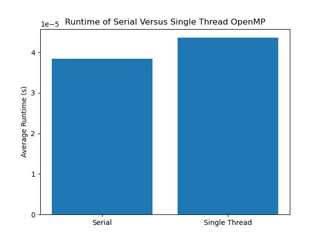
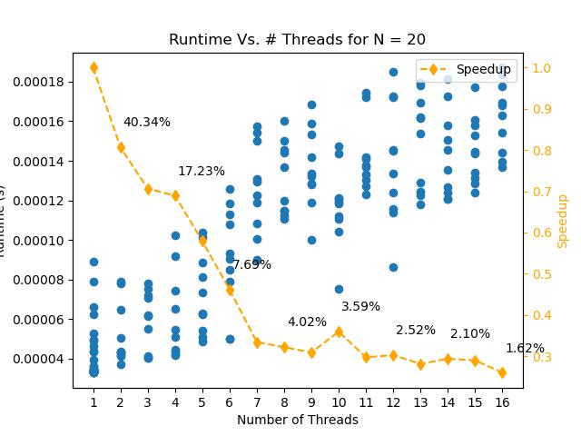
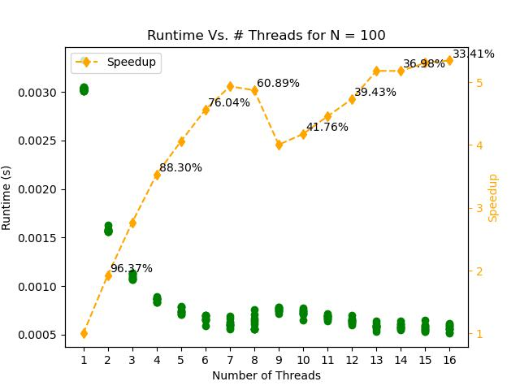
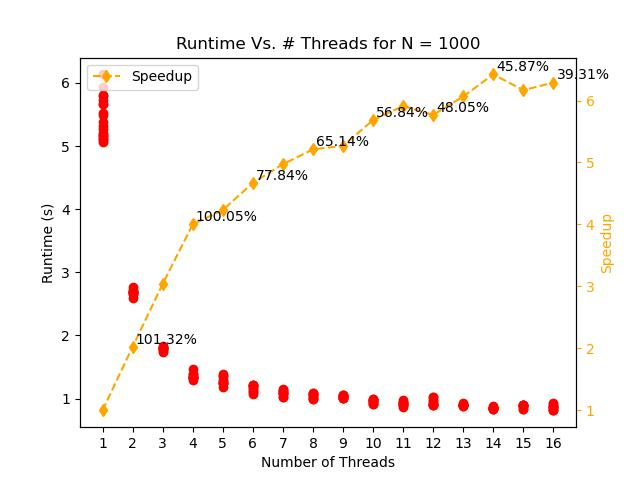

# Project 4: OpenMP and Hybrid Parallelism 

In this project, you will gain experience with the basics of shared-memory parallelism using OpenMP. 
You will also combine distributed- and shared-memory approaches by implementing hybrid parallelism with MPI and OpenMP. 
In addition to the course text book, you may wish to refer to the excellent OpenMP resource pages at <https://computing.llnl.gov/tutorials/openMP/>.

## Part 1: OpenMP Matrix-Matrix Multiplication

Consider the simple matrix-matrix multiplication,

```C
for i = 1, N
  for j = 1, N
    for k = 1, N
      C[i,j] += A[i,k] * B[k,j]
```

What strategies could you use to add parallelism using OpenMP threading to this kernel? Is each of the three loops threadable?

Now, let's implement so OpenMP loop parallelism.

1. Modify your MMM code from Project 1 to implement OpenMP threading by adding appropriate compiler directives to the outer loop of the MMM kernel. When compiling the OpenMP version of your code be sure to include the appropriate compiler flag (`-fopenmp` for GCC).
2. Compute the time-to-solution of your MMM code for 1 thread (e.g., `export OMP_NUM_THREADS=1`) to the non-OpenMP version (i.e., compiled without the `-fopenmp` flag). Any matrix size `N` will do here. Does it perform as you expect? If not, consider the OpenMP directives you are using.

 - Code: matrix_multiplication.cpp
 - Output: MMM_pt1_homePC.csv
 - Discussion: the matrix_multiplication.cpp file can be compiled in both serial and parallel. To compare the two, the code was compiled in serial and parallel, and run with a matrix of size N = 20 for 1000 iterations. The result is presented in the figure above, and suggests that the single thread execution using openMP takes slightly longer then the serial execution. This is due to the additional overhead associated with the openMP intialization. 
3. Perform a thread-to-thread speedup study of your MMM code either on your laptop or HPCC. Compute the total time to solution for a few thread counts (in powers of 2): `1,2,4,...T`, where T is the maximum number of threads available on the machine you are using. Do this for matrix sizes of `N=20,100,1000`.
4. Plot the times-to-solution for the MMM for each value of `N` separately as functions of the the thread count `T`. Compare the scaling of the MMM for different matrix dimensions.




- Code: matrix_multiplication.cpp, Part1_Driver_Visualization.ipynb
- Output: MMM_pt1.csv 
- Discussion - The python driver script drives the runs for various matrix sizes and thread counts. The python script also generates the plots. To calculate the speedup and efficiency, the average runtime for each thread count was considered. From the tree plots above, we conclude that the scaling of the MMM problem improves with larger matrix sizes. For N = 20, the runtime increases with thread count. Therefore, the speedup is less than 1 for increasing thread counts with N = 20. For small matrix sizes, the computational cost in minimal, and the overhead associated with openMP drives the increase in runtime with increasing thread count. For N = 100 and N = 1000, the speedup is greater than 1. The efficiency is displayed on the plots at various points. The efficiency is higher for N = 1000 when compared to N = 100 for all thread counts. For N = 1000, there is near perfect speedup up to 4 threads. With N = 1000, the speedup is early perfect up to 2 threads. These results show that large matrices experience better parallel performance than small matrices. 

5. Verify that for the same input matrices that the solution does not depend on the number of threads.
 - Code: matrix_multiplication_Pt1_Q5.cpp
 - Output: MMM_pt1_q5.csv, A_serial.txt, A.txt, B.txt, C.txt
 - Discussion - The solution was verified to match the serial solution for various matrix sizes and thread counts. A separate .cpp file was written which performs the matrix multiplication in both serial mode, and in parallel using openMP. The code then checks if each of the elements of the matrices are equal within a tolerance of 1e-16 to account for the non-associative and non-commutative property of floating point arithmetic. The code was run for several matrix sizes and thread counts. The results are stored in the output file mentioned above. The third column of the output file is 1 if the matrices matched for serial and parallel execution for the given matrix size and thread count. As shown in the results file, the resultant matrices matched for all matrix sizes and thread counts tested. Each of the matrices were written to a text file for verification and debugging. These text files are available and correspond to the last row in the MMM_pt1_q5.csv file. 

## Part 2: Adding OpenMP threading to a simple MPI application

Take a look at the Hello World applications that we have used in past assignments that include basic MPI functionality. Modify one of these applications to include OpenMP. 

1. Wrap the print statements in an `omp parallel` region.
2. Make sure to modify the `MPI_Init` call accordingly to allow for threads! What level of thread support do you need?
3. Compile the code including the appropriate flag for OpenMP support. For a GCC-based MPI installation, this would be, e.g., `mpic++ -fopenmp hello.cpp`.
4. Run the code using 2 MPI ranks and 4 OpenMP threads per rank. To do this, prior to executing the run command, set the number of threads environment variable as `> export OMP_NUM_THREADS=4`. Then you can simply execute the application with the `mpiexec` command: `> mpiexec -n 2 ./a.out`.
5. Explain the output.

Output:

```
Before initialization
Before initialization
This is thread This is thread This is thread This is thread 2 of 34 in rank 141 of  of 4 in rank 41
This is thread This is thread This is thread This is thread 2341 of 4 in rank 0 of 4 in rank 0 of 
 of 4 in rank 1
 of 4 in rank 0
4 in rank 
0 in rank 1
After initialize
After initialize
```
The outputs outside the OpenMP sections are ordered. But the outputs in the OpenMP sections are not ordered, since they are all executed parallely in the 4 threads in an unordered fashion. But it is somewhat clear from the output that four threads and 2 ranks were in operation.

## Part 3: Hybrid Parallel Matrix Multiplication

Now, let's combine OpenMP and MPI functionality into a hybrid parallel version of the MMM. 

1. Add MPI to  you OpenMP MMM code by distributing the rows of one of the input matrices across MPI ranks. Have each MPI rank perform its portion of the MMM using OpenMP threading. Think very carefully about the structure of the main MMM loops! Once done, gather the resulting matrix on rank 0 and output the result. Verify that for the same input matrices the result does not depend on either the number of MPI ranks or the number of OpenMP threads per rank. 
2. On HPCC, carry out a performance study in which you vary the number of MPI ranks, the number of OpenMP threads per rank, and the matrix size. Make plots showing the times to solution for the various cases. Explain your results.

## What to turn in

To your git project repo, commit your final working code for the above exercises and a concise write-up including all plots, and detailed responses to the questions posed concerning your results. 
